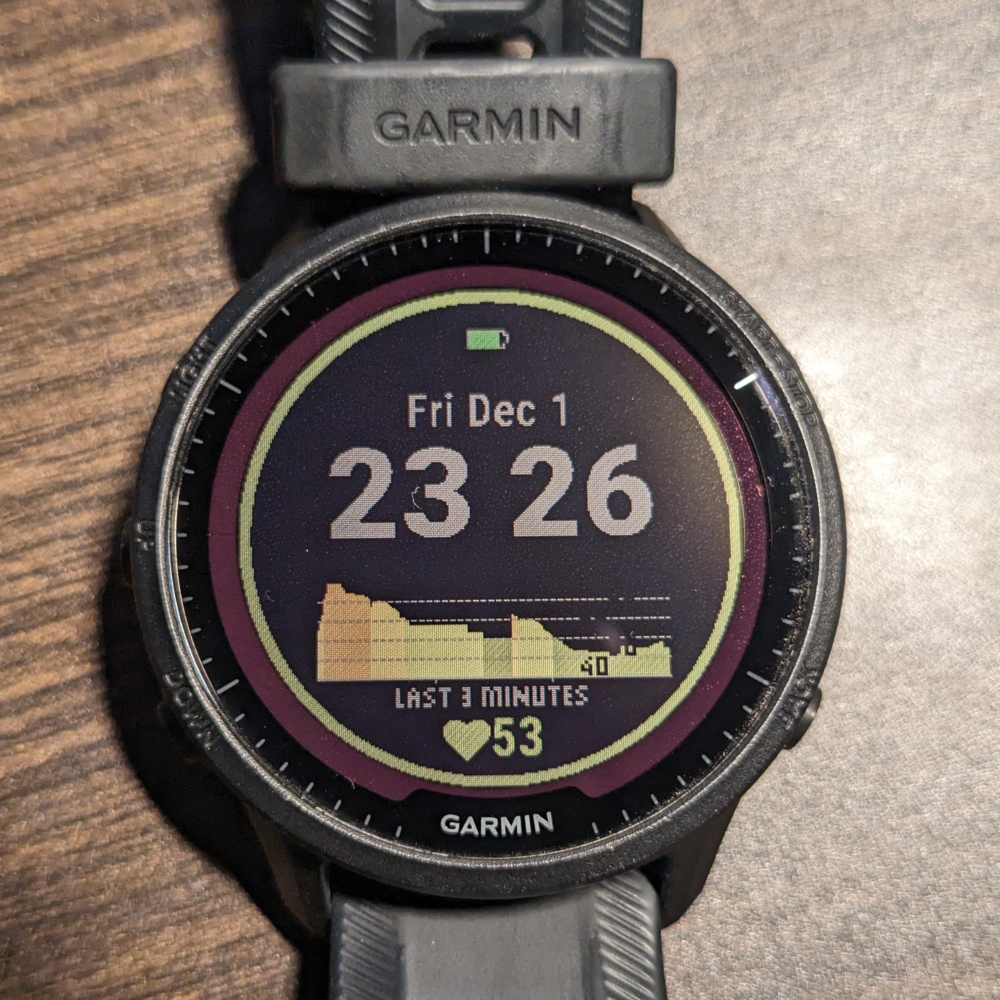
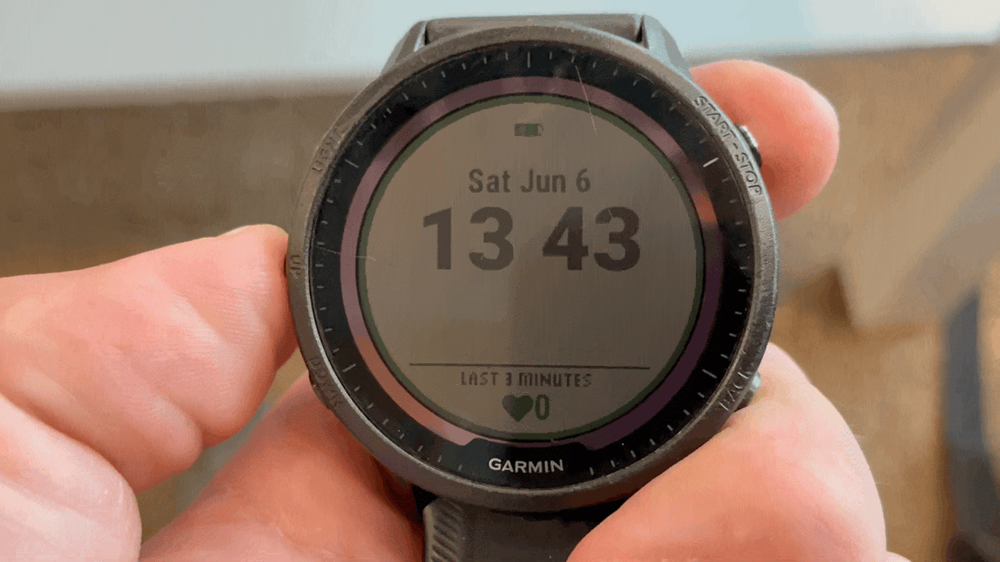
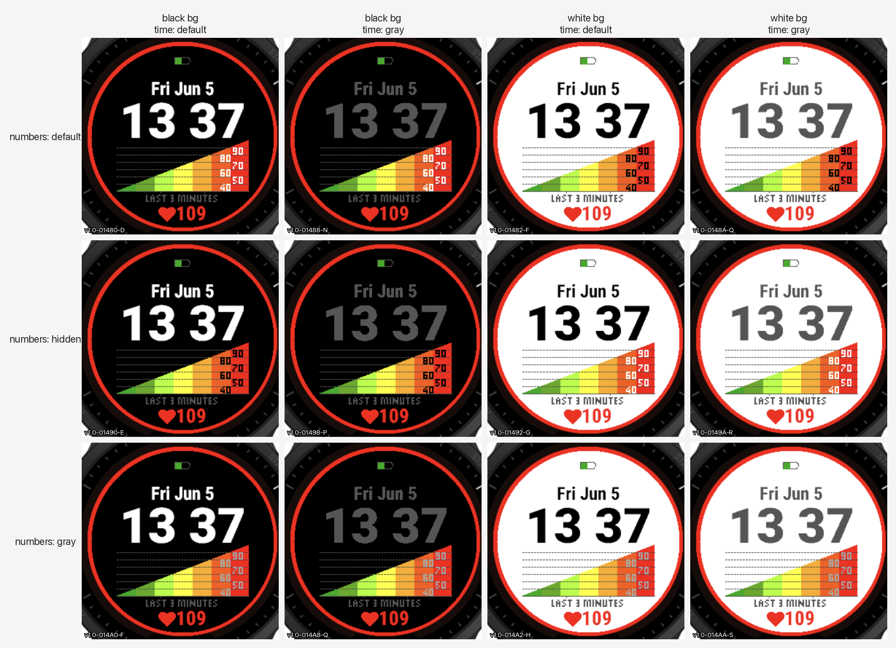
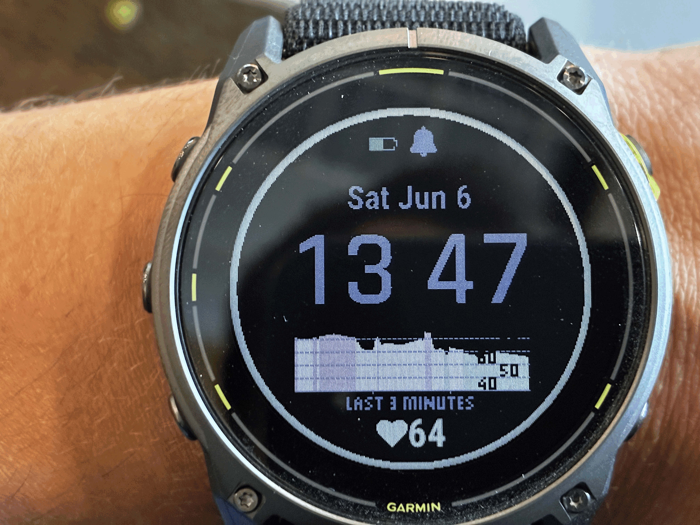
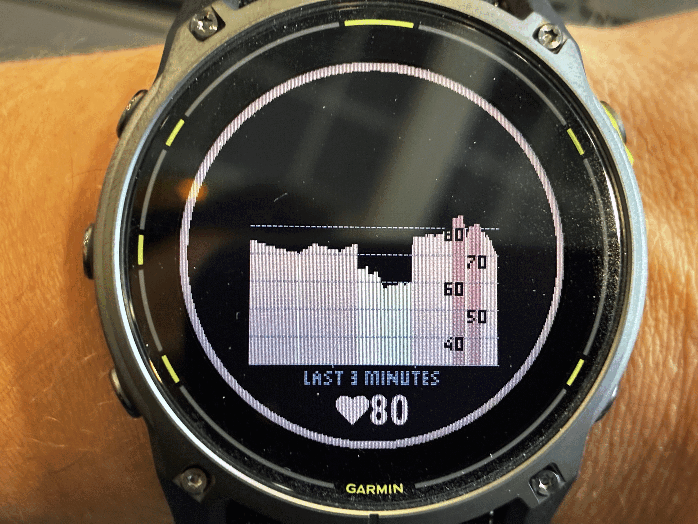

# HeartGraphWatchFace

This is a custom watch face for Garmin watches. It has a rolling bar graph of the last few minutes of the wearer's heart. The bar graph colour codes based on the range of the heart rate. This can be used to infer stress level. During periods of inactivity, the lower the heart rate then the lower the stress. The watch face is designed to be highly customizable to suit the user's needs.

<figure>
  
</figure>

The colour coding is designed loosely on [neurofeedback therapy](https://en.wikipedia.org/wiki/Neurofeedback) where if your brain is given input on the body's internal state then overtime the brain can learn to control it or at least be more aware of what is going on internally. There is a lot of various and interesting research out there on the visual input and the impact it has on people. For [example](https://www.kent.ac.uk/news/science/3082/athletes-perform-better-when-exposed-to-subliminal-visual-cues): 

> research discovered that athletes undergoing endurance exercise who were presented with positive subliminal cues, such as action-related words, including ‘go’ and ‘energy’, or were shown happy faces, were able to exercise significantly longer compared to those who were shown sad faces or inaction words.

Furthermore, the human body is very adaptable and one can learn a lot more about one's body if they just focus on it like with [echolocation](https://en.wikipedia.org/wiki/Human_echolocation). The watch face app provides an opportunity to focus in on one's heart rate.

I believe the correct thought pattern of using this watch is along the lines of 'wow interesting.... my heart rate is in the 80s and Im just sitting here while last time I did that it was in the 60s ...what changed? Oh yeah Im stressin' about that exam... _interesting_ ...why am I stressin'?' - Even if you heart rate is 'too high' then you shouldn't worry too much about it due to "Matthew 6:27". I believe you should also avoid the thought process of "oh wow low heart rate huh? Yeah im in the 'zone' and I'm awesome!" as you will start idolizing your health so that when you encounter a 'bump in the road' your heart rate might spiral away further than necessary.

Does this watch app guarantee certain medical results? Outside of placebo - no. It did help me see how a runaway thought process can jack my heart rate from 50s all the way to the 80s and when I catch myself back down to the 50s all in the span of 30 seconds. This awareness helped me do my best to be aware of thoughts and stresses and not let them run through my mind too much. Overtime, I did notice my average heart rate trend downwards over the course of a year, but this involves more introspection of the soul than just staring at a watch. Recently I noticed heart rate during walking can drop to the mid 80s whereas before it was low 100s (reminds me of [zone 2 training](https://www.youtube.com/watch?v=-6PDBVRkCKc) ).

Furthermore, I must give a strict warning here as this is not for everyone - neurofeedback style techniques can go [very wrong](https://www.reddit.com/r/Neurofeedback/comments/yyyhpg/neurofeedback_destroyed_my_life/) for people and I presume especially so for those that tend to get over anxious over metrics - see your doctor first. There is a great cultural sickness out there of over optimizing health and I do not wish this watch to be part of that (see [here](https://elliotpaisley.substack.com/p/chris-williamson-is-a-slave) for a comedic display of this trend. I also hinted about this concern the older version of this repository with my article [here](https://szonov.com/programming/2023/12/25/the-bionicle-man/)).

In conclusion... By wearing this watch face for many days and months you will have an understanding of how your heart rate can vary. You will learn how your heart can accelerate or calm down. You will observe the impact of thoughts and stress on your heart rate. Even if you think you are calm, then your heart rate may not reflect that. This contrast will encourage you to observe the subtleties in your body and be more self aware. You will learn differences between sitting, standing, walking and that resting heart rate isn't just for sleeping but for sitting or working too... How's that for an informercial?

## Features

The watch face has a lot of various customizations for the user to account for the 'do I look fat in this dress?' concerns as well as the diverse nature of cardiac health due to age, weight, health and activity.

 <figure>
  
  <figcaption>Accessing watch face settings is very quick!</figcaption>
</figure>

 Here is a list of some features:
 - Play with various colours
 <figure>
  
  <figcaption>Various colour settings being modified in the watch: background, time/date text, </figcaption>
</figure>
 - Duration how many minutes worth of heart data do you want to see - last 3 minutes / 5 minutes / 10 minutes 
 <figure>
  
</figure>
 - Remove the time completely from your watch so it is just the heart rate graph ( the gap seen occurs when accessing the watch face's setting page during which the heart data is not being recorded - not a bug!)
 <figure>
  
</figure>
 - Different resolutions
<figure>
  
</figure>

 - All sorts of other combinations (introduce export codes)
<figure>
  
</figure>


- Some of the combinations come prebuilt on the watch and you are free to use them by selecting them in the "Presets" option of the settings page. I specifically found it beneficial to have a separate 'calmer' mode to zoom in on your heart beat when you know it will be in a more restricted range as you resting and not moving around but still want to catch the small peaks and valleys in your heart beat. You can also add your own custom presets and each preset can be described by a specific 'code' which you can reuse on other garmin watches or share them with friends who like your new view!

<figure>
  
</figure>


The watch forces 'military' style time on the user as all other time formats are for wimps!

## How To Install 

The watch face app is available on the Garmin marketplace. TODO: link the app on the store once it is reviewed

### Building and installing from source

(this section here was written by AI)

If you want to hack on the code or sideload a custom build onto your own watch, you can compile straight from this repo. Works on macOS, Linux, and Windows (via Git Bash or WSL). You'll need:

- The [Connect IQ SDK](https://developer.garmin.com/connect-iq/sdk/), installed via the official SDK Manager. `build.sh` looks under the standard per-OS location automatically:
  - **macOS**: `~/Library/Application Support/Garmin/ConnectIQ/`
  - **Linux**: `~/.Garmin/ConnectIQ/`
  - **Windows** (Git Bash / WSL): `$APPDATA/Garmin/ConnectIQ/`

  If you installed to a non-default location, set `CIQ_SDK=/path/to/sdk` and/or `CIQ_KEY=/path/to/developer_key.der` before invoking the script. The script picks the newest SDK present.
- Your **own** developer key. The SDK manager can generate one for you; it lives next to the SDKs as `developer_key.der`. Never reuse someone else's key — the signature is what proves a build is yours.
- Your **own** app UUID in `manifest.xml`. The one checked in (`9272fb58-…`) is the public store listing's ID; mint a fresh one and paste it into the `id=` attribute of `<iq:application>`. Quick way: `uuidgen | tr 'A-Z' 'a-z'` (macOS / Linux) or `[guid]::NewGuid().ToString()` (PowerShell). Sideloading to your own watch doesn't strictly enforce uniqueness — the watch only checks the signature — but using your own ID keeps things clean if you ever publish.
- A way to move files onto the watch's `GARMIN/Apps/` directory. Watches expose themselves as MTP devices:
  - **macOS**: [Android File Transfer](https://www.android.com/filetransfer/) (the watch doesn't show up under `/Volumes/`).
  - **Linux**: any MTP file manager — Nautilus, KDE Dolphin, or `gmtp`.
  - **Windows**: File Explorer sees the watch when plugged in.

Then:

```bash
# Build per-device .prg files (defaults to fr955 + enduro3 — edit DEVICES in build.sh to add more).
./build.sh                 # both devices
./build.sh fr955           # single device

# Plug the watch in, drag bin/HeartGraphWatchFace-<device>.prg into the
# watch's GARMIN/Apps/ folder, then disconnect. The watch reboots and
# the new face appears under:
#   Settings → Watch Face → Add New   (scroll to the bottom of the list).
```

`build.sh` has four modes:

| Command | Output | Includes dev affordances? | When to use |
|---|---|---|---|
| `./build.sh` | `bin/HeartGraphWatchFace-fr955.prg` + `…-enduro3.prg` | yes | Default. Per-device binaries for sideloading to your own watch. |
| `./build.sh <device>` | `bin/HeartGraphWatchFace-<device>.prg` | yes | Single device — faster when iterating. |
| `./build.sh --export` | `bin/HeartGraphWatchFace.iq` | no — stripped | Store-ready bundle for production upload. |
| `./build.sh --export-with-test` | `bin/HeartGraphWatchFace.iq` | yes | Beta sideload `.iq`. Carries the dev app ID instead of the production one. **Never** submit to the store. |

The "dev affordances" are the synthetic-HR Test Data picker (under Modes), the 13:37 clock lock, and a few other testing-only hooks marked `(:dev_only)` in the source. They're stripped only by `--export` via `store.jungle`; everything else keeps them. See `CLAUDE.md` for the full layering story.

## Future Work

There is a lot of potential future work here...as anywhere!

I must first mention that I am very grateful for Garmin's developer platform where one can code up various cool applications for the watch like the one in this repository. Second, I am very grateful for the opportunity to use Claude AI to accelerate the development; over the course of a few days I was able to add a lot of work on top the initial release of this watch (see previous [README](https://github.com/mannyray/HeartGraphWatchFace/tree/e12a46cd0da12e862b87d9f8bd05004ade3e9343)). The changes made in the latest coding push with the help of Claude targeted customization of the watch face, fixing some UX bugs, and code optimization - all that made it possible to polish up and release this app to the Garmin store. Without the AI it would have taken me much much longer to implement the changes by having to dig through the Garmin forums and dev docs to understand how to piece things together that on the surface sound simple, like implementing a colour changing menu, but in practice are annoying when dealing with an unfamiliar programming language and framework. Without AI, the anticipation of the time needed for digging alone would have been the limiting 'static friction' of even attempting this latest push.

Now that the watch is on the app store it can be downloaded by all those who want to monitor their heart rate and get to know their body a little bit better.... although I am not convinced the watch face app alone is sufficient for that purpose similar to how I don't think the duolingo language learning app does much more than waste people's time with screen addiction and in app point collection. Despite being a programmer of this watch app and many other things in the past, with time, I have become more and more skeptical of all things digital and their purported ability to improve the various claimed properties like socialization, productivity, money saving and learning. The times where there is a clear benefit then it seems that some of the underlying premises of what is to be improved are off (like writing predictive software to optimize one's gambling odd - why gamble?) - sorry I am not trying to be a tech debbie downer!

Even with my skepticism, I believe this watch face app is a good prototype for assisting in in-person guided healing of the heart and nervous system - for strengthening the parasympathetic nervous system. It could be used by doctors, in clinics/retreats to help people be more aware of their stress response and heart rate that's off. Combining with breath exercises this could be a very powerful way of helping people reduce stress. The best product I have seen so far that tries this is the Oxa app that combines a heart rate monitor with a breath depth sensor to help people find their resonance breath. However, like with the watch face app, from personal use of the Oxa app, trying to 'optimize my breathing' felt like shooting in the dark with no clear progress even with the app trying to guide the user. I believe the app use would have been way more effective with an in person guide who is proficient in these things as a person can notice so much more that's off about a person's technique (like posture subtleties) - apps can only go so far (maybe like a heart/breathing version of [this article](https://genmuir.substack.com/p/how-to-get-your-kids-to-read-the)). However, some apps might actually be very effective like the online Wim Hof program.

In the past, I have explored creating an Oxa like product by playing with Garmin's heart rate strap (with code in  https://github.com/mannyray/ANTPlusHeartStrap and https://github.com/mannyray/GarminBytePacking), but discovered that there were physical/hardware limitations in getting 'realtime' heart data from the strap and I did not have the resources to make my own. The strap measures the electrical signal of the heart 'beating' and there is a delay on the order of hundreds of milliseconds after which the person would feel that same 'beat' if measuring the pulse on their neck. The idea was to get the watch to vibrate in sync with the 'beat' so that the person can feel their pulse without measuring with their fingers on their neck. However, from experimentation the speed at which the watch would receive the latest electrical signal from the strap was too slow to sync up with the actual 'beat'.

When a person's parasympathetic system is unbalanced then their heart beats significantly accelerates when breathing in and so the idea of creating a vibrating watch synced to the 'beat' of the heart would provide a patient an easy way of being conscious and slowing down their heart - from personal experimentation it is possible to slow your inhalation heart beats if you are simply measuring your neck pulse (carotid pulse) and "thinking of slowing down"  - the strap/app combo would remove the need of holding your finger to your neck and allow you to sit in a relaxed posture. The watch face app in this repository is a shadow implementation of that 'future work' end goal as it shows estimated heart rate from the watch and not the actual incoming beats.

For now this watch app is limited to a those watches that have memory-in-pixel display and have a circular display.
